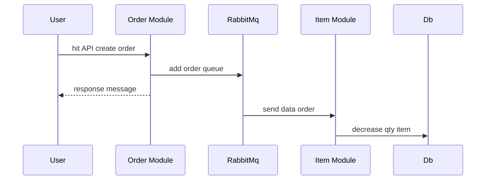

## Description

This Is Repo for Rest API and microservice using rabbitmq as messaging queue, the Rest API framework use [Nest](https://github.com/nestjs/nest).

## Installation

```bash
$ npm install
```

## Running the app

```bash
# development
$ npm run start

# watch mode
$ npm run start:dev

# production mode
$ npm run start:prod
```

## Test

```bash
# unit tests
$ npm run test

# e2e tests
$ npm run test:e2e

# test coverage
$ npm run test:cov
```

## Messaging Workflow
